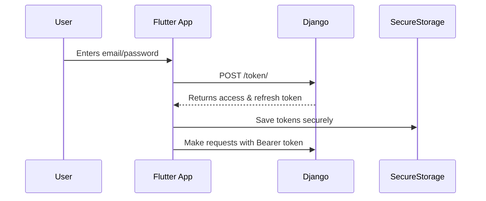

# 🛒 Full Stack eCommerce App

> 🚀 Built with Django + Flutter  
> 🔐 Secure OAuth2 Authentication | 💳 Stripe Payment Integration | 📱 Modern Flutter UI  

---

## 📌 Overview

A full-featured mobile-first eCommerce application with a secure backend and a beautiful frontend. It supports user registration, product listings, shopping cart, orders, and seamless payments using Stripe.

---

## ✨ Features

### 🔐 Authentication
- OAuth2.0 (Access + Refresh tokens)
- Secure login & signup
- Token rotation & revocation
- Persistent login with secure storage (Flutter)

### 🛍️ eCommerce
- Product list & details
- Cart management
- Order placement & tracking
- Product categories & search

### 💳 Stripe Integration
- Secure PaymentIntent flow
- Native Stripe PaymentSheet in Flutter
- Transaction status & confirmation

### 🧑‍💻 Admin Panel (Django)
- Manage products & categories
- View and process orders
- User management

---

## 🔧 Tech Stack

| Layer      | Technologies                                 |
|------------|----------------------------------------------|
| Backend    | Django, DRF, OAuth Toolkit, PostgreSQL       |
| Frontend   | Flutter, Dart, GetX / Provider               |
| Auth       | OAuth2 + Refresh Tokens                      |
| Payments   | Stripe API + PaymentSheet                    |
| Media      | Cloudinary (optional for image hosting)      |

---

## 🛠️ Backend Setup (Django)

1. Clone the repo:

   ```bash
   git clone https://github.com/lib1221/ecommerce-full-stack-mobile.git
   cd ecommerce-app/backend
   ```

2. Create virtual environment:

   ```bash
   python -m venv env
   source env/bin/activate
   ```

3. Install dependencies:

   ```bash
   pip install -r requirements.txt
   ```

4. Run migrations:

   ```bash
   python manage.py makemigrations
   python manage.py migrate
   ```

5. Create superuser:

   ```bash
   python manage.py createsuperuser
   ```

6. Run server:

   ```bash
   python manage.py runserver
   ```

---

## 📱 Frontend Setup (Flutter)

1. Navigate to the frontend:

   ```bash
   cd ../flutter_app
   ```

2. Install packages:

   ```bash
   flutter pub get
   ```

3. Set environment (API URLs, Stripe key) in `lib/config.dart`.

4. Run app:

   ```bash
   flutter run
   ```

---

## 🔐 Authentication Flow



---

## 💳 Stripe Payment Flow

1. Flutter app requests a PaymentIntent from backend:

   ```http
   POST /api/create-payment-intent/
   ```

2. Backend uses Stripe API to create PaymentIntent.

3. Flutter initializes PaymentSheet using `stripe_payment`.

4. User pays and gets confirmation.

---

## 🤝 Contributing

```bash
git clone https://github.com/Lib1221/ecommerce-full-stack-mobile.git
git checkout -b feature/your-feature
git commit -m "feat: add your feature"
git push origin feature/your-feature
```

## Documentation

Developer docs live in [`docs/`](docs/):

- [Architecture](docs/ARCHITECTURE.md)
- [Setup](docs/SETUP.md)
- [Contributing](docs/CONTRIBUTING.md)
